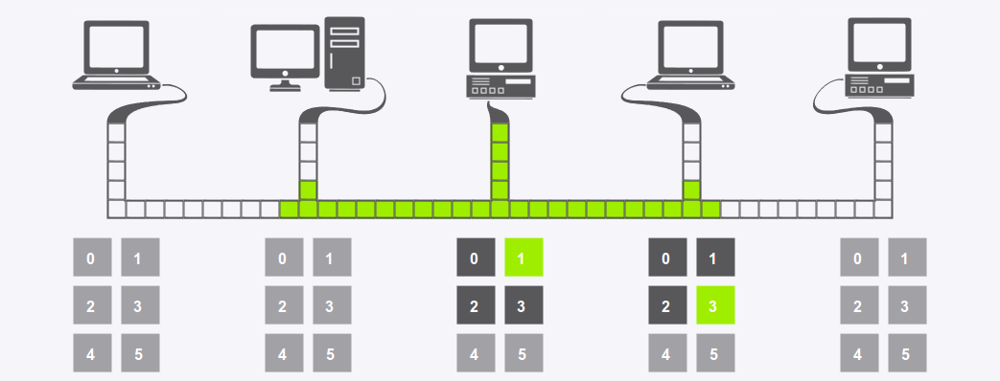

CSMA/CD simulation
==================

A live demo can be found [here](http://kgilden.github.io/csma-simulator/).

This is a simple simulation of CSMA/DA on a 5-computer LAN setup written in
JavaScript. The computers can send telegrams to each other and use exponential
backoff to space out repeated retransmissions of the same block of data.

A red block means collision, all other colors represent data. Darker grey
squares below each computer indicate the possible slots the computer can choose
for retransmitting. Random choices are indicated by green. Manually chosen slots
are colored dark red.

The number on device screens displays the number of retries the device has made
to transmit a telegram. The number next to the cable displays the number of slot
times left until the device attempts to retransmit the last packet.

Switching on short telegrams illustrates what would happen if the telegrams were
too short. &ndash; the transmitting device will think the transmission was
successful even if there was a collision.

Instructions
------------

 * Click on two computers to send a packet from one to the other;
 * For deterministic slot times click on any of the numbered buttons. The device
   above will then always wait until the given slot time to transmit its
   telegram. Clicking on the chosen button again will enable random slot time
   selection;
 * The simulation can be paused at any time using the button in the lower left
   corner. Mouse events won't be disabled so you could for example issue several
   transmits and unpause to synchronise;
 * You can unpause by clicking on the pause button again;
 * FPS can be controlled by clicking on the two arrow buttons on the lower left
   corner;
 * To change the packet length, either click on "Long telegram" or "Short telegram";

Running the tests
-----------------

To run unit tests, you'll need to fire up [tests.html](tests.html) in your
favorite web browser.

License
-------

`csma-simulator` is released under MIT License. See the bundled
[LICENSE](LICENSE) file for details.

